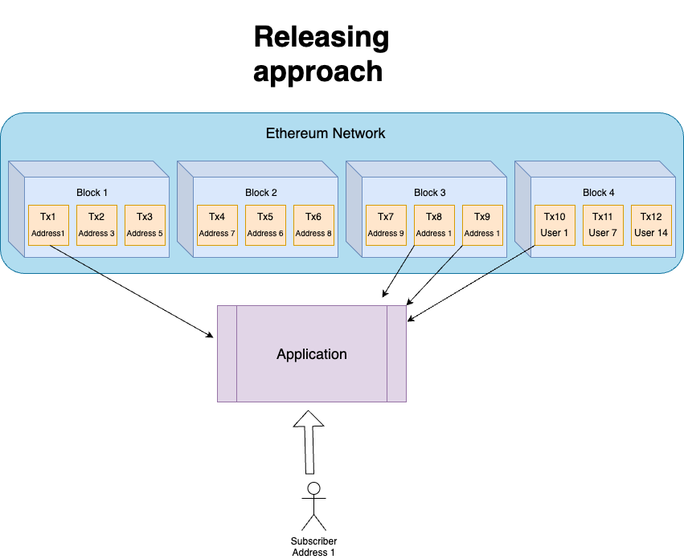
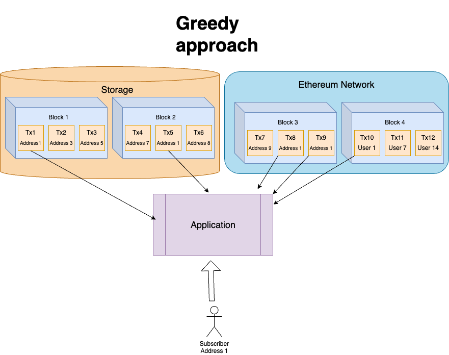

## Ethereum Subscriber 

Subscriber providing interface for listening upcoming transactions in 
Ethereum Network


## Install

Current implementation provide 2 usage interface: CLI and HTTP Api

### CLI

To install CLI and use it just install it through go install
```shell
go install github.com/bluntenpassant/ethereum_subscriber/cmd/ethereum_subscriber-cli
```
after you can open user-cli with command
```shell
ethereum_subscriber-cli
```

### API 

To install API and use it just install it through go install too
```shell
go install github.com/bluntenpassant/ethereum_subscriber/cmd/ethereum_subscriber-api
```

after you can launch HTTP api server with command
```shell
ethereum_subscriber-api
```

NOTE: If you need to change app configuration that might be
very helpful for launch different scenarios, you need to download source code 
and change configuration directly in app. In further we will provide interface for
changing configs directly through CLI, but now... life is life 3>

## Methods

Ethereum subscriber at the current moment supports 3 methods for interaction

|        Command        | Description                                                                                                                                                                                                                                                                                                                                                                                                                                                                                       |
|:---------------------:|---------------------------------------------------------------------------------------------------------------------------------------------------------------------------------------------------------------------------------------------------------------------------------------------------------------------------------------------------------------------------------------------------------------------------------------------------------------------------------------------------|
| **`GetCurrentBlock`** | Returns last parsed block between all transactions. Current block is not attached to last parsed transaction and indicates only block number that was handled by internal parser                                                                                                                                                                                                                                                                                                                  |
|      `Subscribe`      | Subscribe address for a listening new transactions                                                                                                                                                                                                                                                                                                                                                                                                                                                |
|   `GetTransactions`   | Returns all history of transactions for a given address since subscribe until memory storage is cleaned.                                                                                                                                                                                                                                                                                                                                                                                          |

## Approaches

Now Ethereum Subscriber supports two different approaches in transactions handling.
You can change current approach with parameter `General->Approach`

Subscriber uses for a getting a full list of inbound or outbounds transactions by user since subscription.
Due to simple transactions in Ethereum Network are not indexed, we cannot get it through simple JSONRPC methods.
This method uses heuristic approach without having to process the entire chain.

### Releasing
Subscriber in releasing approach mode everytime handling all transactions since subscription time.
After handling a bunch of blocks and transactions handler releases all data in runtime and waiting for
another task
This approach will be suitable in case when you're launching program in a short-term.
Approach does not consume many resources and might work fast enough, cause handler does not need to 
save data in distributed storage everytime, it saves only minimum data about subscription block and count of
transactions, you can use memory storage for this approach. But if you`re planning to keep program long keepalive time
Greedy approach will be more convenient and effective for you



### Greedy
In greedy approach handler goes a little different way and trying 
to save as much as possible transaction in storage to prevent case
when we request data, that we already handled. Instead of releasing data
after every handling, handler saves data into storage and actively using
storage for caching handled transactions. You can configure transaction lifetime
with parameter `Storage->Redis->data_keep_alive_duration`



## Processing
We have two different processing approaches in handling data
* Synchronous: using for consequentially handling data one by one. 
This approach guarantees order of every transaction (last -> first)
* Asynchronous: using random handling data. 
Order of this processing approach is random, and you might need extra 
sorting operations for handling data correctly

You can choose more convenient parameter for you with parameter `General->Processing`